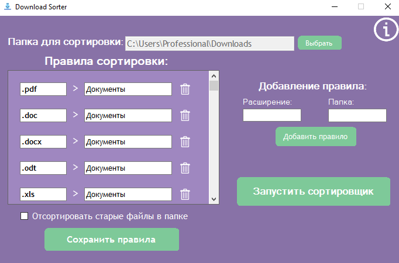

  

<h1 align="center">📂 DownloadSorter</h1>
<h3 align="center">Автоматическая сортировка файлов в выбранной папке</h3>

  
  

---

## 🚀 Возможности

✅ Супер **простой** интерфейс  
✅ Автоматически сортирует файлы из **выбранной папки** по расширениям:  
✅ Документы, изображения, видео, программы, архивы и многое другое.  
✅ Работает в **фоновом режиме**.  
✅ Не тормозит скачивания — дожидается завершения загрузки файла.  
✅ Можно отсортировать старые файлы.  
✅ Настраиваемые категории: добавляйте свои типы файлов.  
✅ Поддержка автозапуска.  
✅ Удобные уведомления о перемещении файлов.  

---

## 🖼 Скриншоты

---

## 🧰 Установка

1. Скачайте последнюю версию установщика с [**страницы релизов**](https://github.com/lilguch/DownloadSorter/releases).  
2. Запустите `DownloadSorter_Setup.exe` — установка **не требует прав администратора**.  
3. При желании отметьте галочку «Добавить в автозагрузку».  
4. Готово! Приложение появится в трее и начнёт следить за загрузками в выбранной папке.  

---

## ❤️ Поддержка проекта

Если программа оказалась полезной — поддержите разработку:

**💵 Карта**	[https://pay.cloudtips.ru/p/399428b8](https://pay.cloudtips.ru/p/399428b8)  
**🅱️ BTC** bc1qxlw3hy0n86d8wwyvsxgkfr744scdpl23w7evhn  
**💰 USDT Tron** TRdg4x46DWnLEZ7S81znTYpcdJSxCyMMLU  
**💰 USDT Ethereum** 0xbF47cbbf41B198c0F98c4d196D6170cA9Ae2Fc2a  

Каждая поддержка помогает развивать проект и добавлять новые функции ❤️
--
